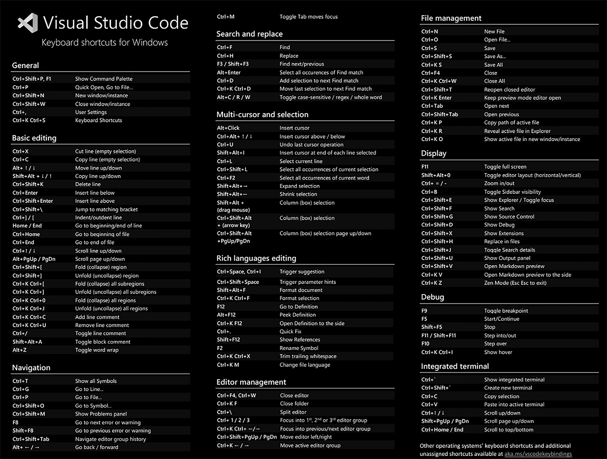
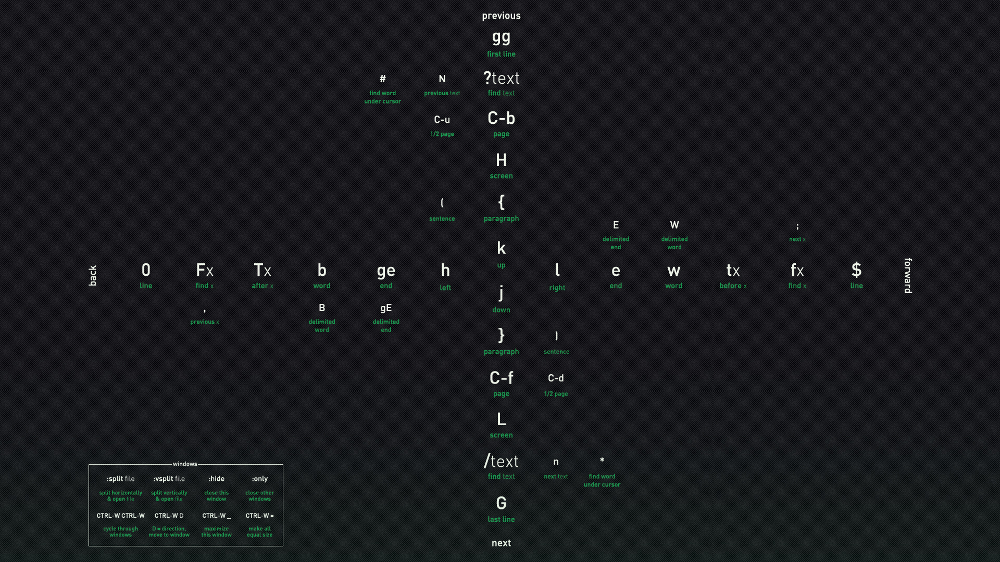

# A repository full of little tools and scripts

## 1. Scripts

    1. autohotkey scripts
    2. batch scripts
    3. blender scripts
    4. maxscript scripts
    5. photoshop scripts

## 2. Cheat Sheets

- Vscode Keybinds cheatsheet

- Vim cheatsheet

- tmux cheatsheet

## 2. Useful windows apps

### Night's Bread

Name | Description | Size     | Download URL
---------|----------|---------|---------
WinRar 💲 | Rar/Zip | ~6 MB | https://soft98.ir/software/compress/21-winrar-full.html
IDM 💲 | Download Manager | ~10 MB | https://soft98.ir/internet/download-manager/4-internet-download-manager-4.html
Chrome | Browser | ~90 MB| https://www.google.com/intl/en_uk/chrome/
PotPlayer | Media Player | ~32 MB | https://potplayer.daum.net/
Discord | Voice/Video Calls | ~80 MB | https://discord.com/download
Skype| Voice/Video Calls | ~90 MB | https://www.skype.com/en/get-skype/

### Developement

Name | Description | Size     | Download URL
---------|----------|---------|---------
VS Code | Code Edtor/IDE | ~90 MB | https://code.visualstudio.com/download
Sublime Text | Fast Code Editor | ~20 MB | https://www.sublimetext.com/
Python | Programming Language | ~27 MB | https://www.python.org/download
Node | Programming Language(!) | ~30 MB | https://nodejs.org/en/
Rust | Programming Language | ~10 MB | https://www.rust-lang.org/tools/install

### Productivity

Name | Description | Size     | Download URL
---------|----------|---------|---------
Blender | 3D software | ~200 MB | https://www.blender.org/download/
Gimp | Aweful Photoshop replacement | ~250 MB | https://www.gimp.org/downloads/
Photoshop 💲 | Best | ~1.5 GB | https://soft98.ir/software/pic-tools/3153-%D8%AF%D8%A7%D9%86%D9%84%D9%80%D9%88%D8%AF-%D9%86%D8%B1%D9%85-%D8%A7%D9%81%D9%80%D9%80%D8%B2%D8%A7%D8%B1-%D9%81%D9%80%D8%AA%D9%80%D9%88%D8%B4%D9%80%D8%A7%D9%BE.html
Davinci Resolve | Video Editing | ~3.2 GB | https://www.blackmagicdesign.com/products/davinciresolve
Davinci Resolve 💲 | Video Editing | ~3.2 GB | https://soft98.ir/multi-media/edit-video/17510-Davinci-Resolve.html
Shotcut | Simple Video Editor | ~100 MB | https://shotcut.org/download/

### Utility Apps

Name | Description | Size     | Download URL
---------|----------|---------|---------
TreeSize | Disk space management | ~11 MB| https://www.jam-software.com/treesize_free
UltraSearch | Locate files and folders faster? | ~14 MB | https://www.jam-software.com/ultrasearch_free
Everything | Locate files and folders fast. | ~2 MB | https://www.voidtools.com/Everything-1.4.1.1018.x64-Setup.exe
Wox | An effective launcher for windows | ~10 MB | https://github.com/Wox-launcher/Wox/releases/download/v1.4.1196/Wox-Full-Installer.1.4.1196.exe
